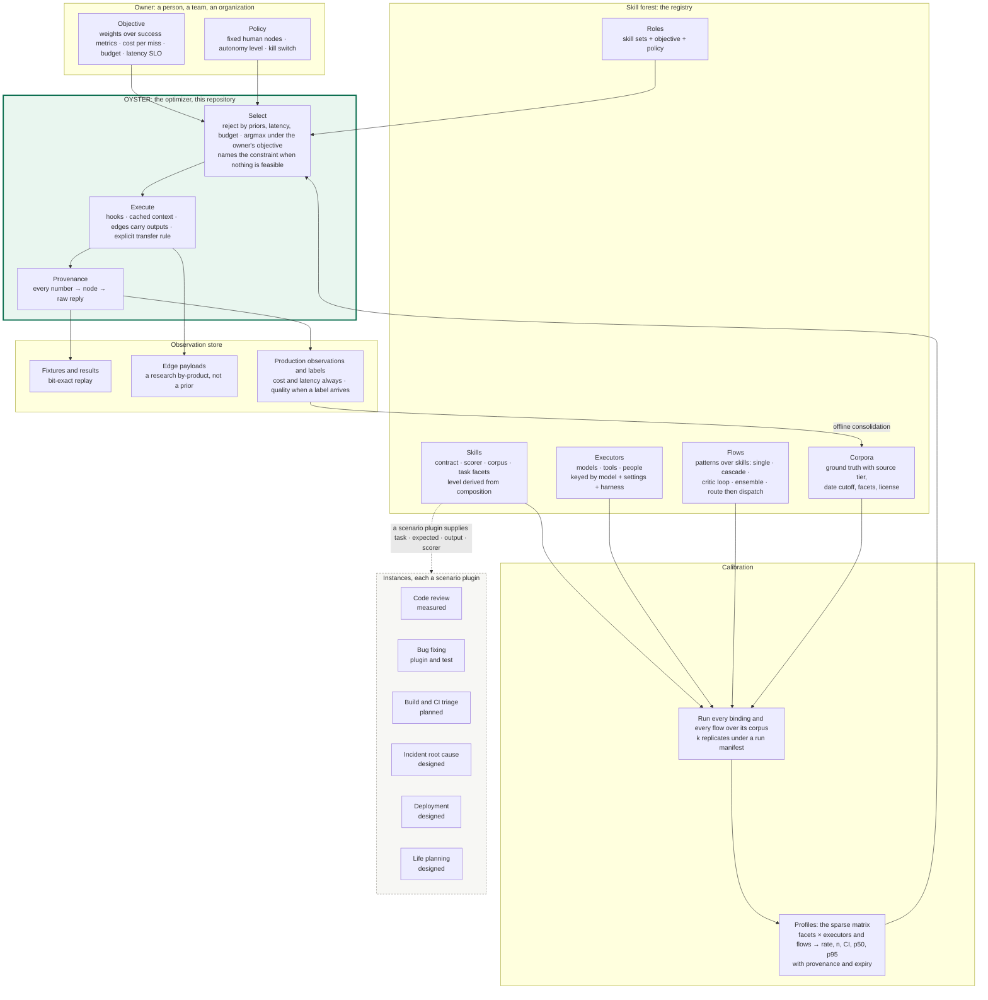
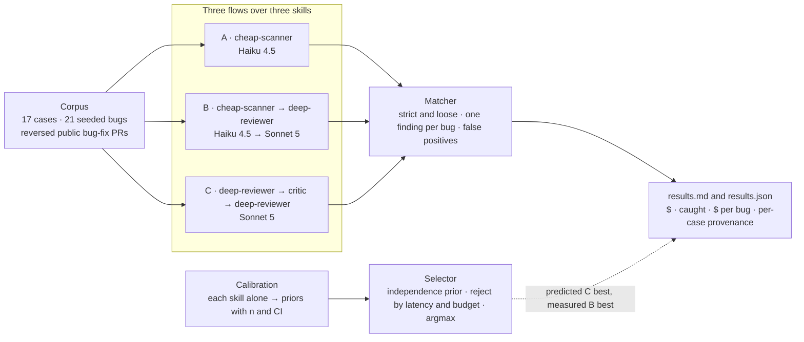

# OYSTER

**O**rchestration with **Y**our **S**uccess metrics, **T**ransparent **E**valuation & **R**outing.


OYSTER is the optimizer inside a larger idea: a **skill forest**, where every capability an
organization or a person relies on is a measured skill with its own ground truth, skills
compose into functions and roles, and at every level the same question is answered the same
way: given this task, this budget and *your* success metrics, which path, executed by whom,
and how do we know. OYSTER is the part that selects and executes a path under the owner's
objective and shows its work. The registry, the calibration, the observation store and the
instances are the rest of the vision; this repository holds the optimizer, the first measured
instance (pull-request review), and the shapes the other parts must fit.

The claim under test in the first instance: an orchestrator operating on a uniform graph
representation can select, under an explicit cost budget, a review strategy whose measured
bugs-caught-per-dollar beats any fixed single strategy, and can show its work. The first run
is below, including the place where the optimizer was wrong.

## The north star



Every part of this picture has neighbors: routing and cascades, compound-system optimizers,
evaluation platforms, review-agent benchmarks, skill registries. What the vision adds, and what
it borrows, is laid out in [`docs/RELATED-WORK.md`](docs/RELATED-WORK.md).

Seven principles hold the picture together; the full statement is in
[`docs/PLATFORM.md`](docs/PLATFORM.md) and the general model in
[`docs/SKILL-FOREST.md`](docs/SKILL-FOREST.md):

1. A skill's level is derived from composition, never declared.
2. Skills are executor-agnostic; which models, tools or people can perform them is measured.
3. Profiles are distributions with provenance: sample size, interval, p50 and p95, expiry.
4. Composites are measured end to end; the independence formula is only a labeled prior.
5. Flows are data instantiated from patterns; the optimizer selects, it does not improvise.
6. Reproducibility has three layers: bit-exact replay, replicates, and decisions that are pure
   functions of a profile snapshot.
7. Objectives and policy belong to the owner, priors to measurement, intermediate products to
   research, and they are stored apart.

## What exists today



- **Engine**: graph validation, cost vector, executor with hooks and cached context, selector
  with an explicit objective and an explicit answer when nothing is feasible, calibration and
  rendering. Every module owns its directory; an import-walk test enforces the boundaries.
- **Scenario plugin**: `oyster/scenario.py` is the protocol; code review is the first
  instance; bug fixing is the second, run through the unchanged engine as the genericity test.
- **Providers**: mock replay, the Anthropic API, the Claude Code CLI on a subscription, and a
  conversation mode that turns any chat window into a provider by pasting prompts.
- **Registry**: `registry/` holds the review skill, its executors, corpus, flows and role in
  the shapes of `docs/PLATFORM.md`; profiles are the generated `priors.json`.
- **Results page**: `tools/build_site.py` writes a single-file page with the table, a
  selection explorer and per-case provenance; the `pages` workflow publishes it once the
  repository is public.
- **Corpus**: two tiers. The reviewed tier (17 cases) is behind every committed number; the
  auto tier (183 cases from 146 public repositories, labels unreviewed) is built by
  `tools/build_corpus.py` and evaluated separately.
- **Tests**: 156, all offline.

## Results: first run

17 cases, 21 seeded bugs, cheap-model = Claude Haiku 4.5 (no extended thinking), strong-model
= Claude Sonnet 5 (medium effort), run in conversation mode on a claude.ai subscription. Full
table with per-case detail: [`results/conversation-haiku45-sonnet5/results.md`](results/conversation-haiku45-sonnet5/results.md).
Dollars are `chars // 4` token estimates at API list rates, so read them as relative.

| path | $ total (est.) | strict caught | loose caught | seeded | $/bug (strict) | false positives |
|---|---|---|---|---|---|---|
| A single cheap pass | $0.0120 | 15 | 15 | 21 | $0.0008 | 2 |
| B cascade cheap → strong | $0.0446 | 16 | 16 | 21 | $0.0028 | 2 |
| C reviewer → critic → reviewer | $0.0975 | 14 | 14 | 21 | $0.0070 | 2 |

Calibrated priors, each node alone, with Wilson 95% intervals: cheap-scanner 0.82 logic
(n=17, 0.59 to 0.94) and 0.25 security (n=4, 0.05 to 0.70); deep-reviewer 0.71 and 0.50;
critic 0.94 and 0.50.

What the table says:

- **The cheap first pass does most of the work.** One Haiku call caught 15 of 21 for under a
  tenth of a cent per bug. The cascade added one catch, a security bug the scanner missed
  (flatbuffers-9081), at 3.7 times the cost.
- **One critique round cost 8 times as much and caught fewer.** Path C's last reviewer
  re-describes locations rather than accumulating them; in three cases (coremltools-2714,
  zstd-4626, swiftcollections-661) an upstream catch drifted off the seeded line range by the
  final node and became a miss. That is the spec's last-node-wins rule doing exactly what it
  says, and it is the right rule for a critic path; the table shows what it costs.
- **The selector was wrong, measurably.** Under the independence assumption it predicted C
  best (quality 0.62) and picked it under a $1 budget. Measured, C was worst. The nodes are not
  independent detectors: the critic and the second reviewer re-judge the same findings
  instead of adding new ones. Knowing where the model is wrong is part of the deliverable, and
  this is where.
- **With a person in the loop the objective flips.** Counting a human cost `h` per missed
  bug, the cascade beats the cheap pass for any `h` above about three cents, and the AI dollar
  column stops mattering. Same table, same engine, one weight changed; the results page has
  a slider for it.

Caveats, in addition to the Limitations below: the corpus is reversed fixes, which show the
correct code being replaced and are easier than wild bugs; several requests shared one chat
context per message; these repos are popular enough that the fixes may be in training data;
and 21 bugs is a small sample, so a one- or two-bug difference between paths is noise.

## Quickstart

Requires [`uv`](https://docs.astral.sh/uv/). Python 3.12 is installed by `uv` automatically.

```bash
make install       # uv sync
make lint          # ruff check + ruff format --check
make test          # pytest, fully offline
make eval-mock     # results.md + results.json from the mock provider, zero spend
```

A bare clone reproduces the committed table with no key: replaying the recorded chat replies
regenerates it to the cent.

```bash
uv run python -m oyster.cli eval --provider mock --fixtures fixtures/conversation/haiku45-sonnet5 --label "replay"
```

`PROVIDER` defaults to `mock`. Real API runs require it explicitly:

```bash
cp .env.example .env            # add OYSTER_ANTHROPIC_API_KEY, verify the rates
make calibrate PROVIDER=anthropic   # writes priors.json
make eval PROVIDER=anthropic        # writes results.md and results.json
uv run python -m oyster.cli select --budget 1.00 --latency 120
```

The anthropic provider prints a cost estimate and asks for confirmation (`--yes` to skip),
and records every completion under `fixtures/mock/` so the run replays offline forever after.
CI never has an API key; it runs `install`, `lint`, `test` and `eval-mock`.

**No `make` on Windows?** Every target is a one-liner: `uv sync`, `uv run pytest -q`,
`uv run ruff check . && uv run ruff format --check .`,
`uv run python -m oyster.cli eval --provider mock`.

## Running on a subscription instead of an API key

A tool built to save money should not need API spend to prove it. Two routes run the same
engine, prompts and matcher with no API billing; the results header labels which one produced
the table.

**Route 1: Claude Code CLI on your subscription (`--provider claude-code`).** The provider
shells out to `claude -p` in print mode with the diff in `--system-prompt-file`, no tools and
one turn, and reads the token usage the API reported from the CLI's JSON result. Numbers are
real token counts priced at API list rates. One-time setup, then the matrix:

```bash
claude setup-token        # or `claude auth login`; stores a subscription token for headless use
```

```bash
uv run python -m tools.run_matrix --provider claude-code
```

`tools/run_matrix.py` runs calibrate, eval and select for three model pairs (Haiku 4.5 +
Sonnet 5, Sonnet 5 + Opus 5, Haiku 4.5 + Fable 5.1) and writes `results/summary.md`. Calls
count against subscription usage limits, not a bill.

**Route 2: any chat window (`pack` / `ingest`).** No CLI, no key, works with claude.ai or any
other subscription chat. The engine emits the prompts it would have sent, you paste them into
a chat, and the replies become fixtures that the mock provider replays:

```bash
uv run python -m oyster.cli pack --fixtures fixtures/conversation --out packs
```

`packs/round-1/pack.md` holds the messages (by default 20 requests per message, grouped by the
model each should run on) and `manifest.json` ties every request to its fixture key. Paste
each message into a fresh chat on the named model, save the reply into a responses file, then:

```bash
uv run python -m oyster.cli ingest --pack packs/round-1 --responses replies.md --fixtures fixtures/conversation --model-label "chat:claude-sonnet-5"
```

Run `pack` again: round 2 contains the cascade's second node and the critic, whose prompts are
built from the round 1 findings, and round 3 the final reviewer. When `pack` reports nothing
pending, render the table:

```bash
uv run python -m oyster.cli eval --provider mock --fixtures fixtures/conversation --label "conversation: claude.ai Sonnet 5 (estimated tokens)"
```

For 17 cases that is 51 + 34 + 17 = 102 requests in three rounds, six chat messages per model
pair. What differs from an API run, stated in the label: token counts are `chars // 4`
estimates because a chat UI reports none, latency is not measured, and a batched message puts
several requests in one context behind a transport wrapper; the per-request text is the exact
template rendering, so `--batch-size 1` gives one prompt per chat with no wrapper.

## Building the corpus from bug-fix PRs

The fastest honest source of seeded bugs is a real fix. `tools/pr_to_case.py` reverses a
bug-fix pull request so the fixed code becomes "before", the buggy code becomes "after", and
the lines the fix replaced become the seeded bug on the new-file side:

```bash
uv run python -m tools.pr_to_case --pr https://github.com/OWNER/REPO/pull/123 --id case-02 --out drafts
```

It drops tests, mocks, docs and generated files (a reversed diff that deletes a regression
test gives the answer away), strips the fix's own comments from removed lines, flags fixes
that only added code, guesses a category from the PR text, runs a leak check, and validates
the draft. Each draft comes with a `.review.md` showing every candidate in context. You still
choose the PRs, confirm category and range, rewrite the description as what is wrong, trim big
diffs with `--files`, and move the file into `oyster/corpus/cases/` yourself. The 17 committed
cases and their sources are listed in
[`oyster/corpus/cases/SOURCES.md`](oyster/corpus/cases/SOURCES.md).

### The auto tier: 183 more cases, labels unreviewed

`tools/build_corpus.py` runs the same reversal without a person in the loop. It searches 146
public repositories (Apple and swiftlang, OpenAI, AI2, Anthropic, the Model Context Protocol
organisation, NVIDIA and the CUDA ecosystem, LiteLLM, vLLM) for merged PRs since September
2025 whose titles read like fixes; drops chores, bots, and anything over four files or 150
changed lines; reverses each candidate; and keeps only drafts that pass mechanical gates
(validator, source files only, at most three files, six hunks and 120 diff lines, one to three
change blocks, no leaked fix vocabulary). Filling round-robin across organisations and
repositories from 8,971 search hits gave
[`oyster/corpus/cases-auto/`](oyster/corpus/cases-auto/): 183 cases, 314 seeded bugs, 13
languages, 19 labelled security by keyword. Nobody reviewed those labels. The tier's
[README](oyster/corpus/cases-auto/README.md) says what is real (the diff, the seeded range,
the provenance) and what is a guess (the category, the description, whether the bug is
findable from the diff alone); the funnel is in
[`BUILD-REPORT.md`](oyster/corpus/cases-auto/BUILD-REPORT.md) and every PR considered is in
`candidates.jsonl`. `--corpus` is repeatable, the tiers are evaluated separately, and their
numbers are never merged. The auto tier has not been run yet: at six calls per case it is
about 1,100 requests, a job for `--provider claude-code` rather than a chat window.

## Reading `results.md`

```
| path | description | $ total | strict caught | loose caught | seeded | $/bug (strict) | p50 latency | halted |
```

Every path gets a row, including bad performers. `$/bug` is `total_dollars / strict_caught`,
rendered `n/a` when nothing was caught strictly. `halted` counts cases where a hook stopped
the run early; a halted run is data, not an error. Per-case detail follows, one table per
path, then the Limitations section verbatim. `results.json` retains every `PathResult` and
`MatchReport` behind the table, and the raw chat replies behind those are archived next to it.

## Documents

- [`docs/ARCHITECTURE.md`](docs/ARCHITECTURE.md): what and why, for the first instance. The
  graph model, the selection objective, the evaluation method and the non-goals.
- [`docs/BUILD-SPEC.md`](docs/BUILD-SPEC.md): how. Frozen contracts, per-module acceptance
  criteria and the rule that an agent stops and reports rather than guesses. The engine was
  built from this document by coding agents in one day; the tests enforce it.
- [`docs/SKILL-FOREST.md`](docs/SKILL-FOREST.md): the general model (task, expected, output,
  scorer, skill, executor, binding, composite, cost, prior, objective, provenance), review as
  one instance, and the next ones.
- [`docs/PLATFORM.md`](docs/PLATFORM.md): the registry schemas, the run manifest, the sparse
  matrix, the feedback loop, and what changed since the spec.
- [`docs/instances/BUILD-CI.md`](docs/instances/BUILD-CI.md) and
  [`BUILD-CI-PLAN.md`](docs/instances/BUILD-CI-PLAN.md): the model applied to a cloud build
  and CI platform, where the oracles are free and the objective is asymmetric, with a phased
  plan to a first table on public Bazel repositories.
- [`docs/instances/LIFE-PLANNING.md`](docs/instances/LIFE-PLANNING.md): the model applied to
  a person planning from school into work, with wellbeing models as the objective's schema and
  the person as the owner of the weights.
- [`docs/GETTING-STARTED.md`](docs/GETTING-STARTED.md): reproducing the table from a bare
  clone, the three ways to make new numbers, adding an API vendor, comparing runs honestly.
- [`docs/WALKTHROUGH.md`](docs/WALKTHROUGH.md): a thirty-minute reading order through the
  code, with the rules that produce every number.
- [`docs/RELATED-WORK.md`](docs/RELATED-WORK.md): what exists next to each part of the vision
  (routing and cascades, compound-system optimizers, DSPy-style program optimizers, bandits,
  evaluation platforms, review-agent benchmarks, bug corpora, CI triage, skill registries,
  human skills taxonomies, delegation, judges, wellbeing) and what the vision adds.

## Repository layout

```
oyster/
  types.py            frozen contracts every module compiles against (v2 additions are additive)
  config.py           settings (OYSTER_* env, .env) and model bindings
  scenario.py         the plugin protocol: task, expected, output, render, parse, keep, score
  scenarios/          code_review (the first instance) and bug_fixing (the genericity test)
  prompts/            prompt templates, verbatim from the spec, plus rendering
  graph/              path validation and the three-path catalog
  cost/               pricing formula, path cost, token estimator
  providers/          mock (fixture replay), anthropic, claude-code (subscription), recording
  conversation/       prompt packs and reply ingestion: any chat window as a provider
  corpus/             loader and validator; cases/ the 17 reviewed PRs, cases-auto/ 183 unreviewed
  matching/           finding-to-seeded-bug matcher
  executor/           runs a path: hooks, cached diff, upstream outputs, JSON repair
  selector/           predict and select under budget and latency tolerance
  evaluation/         calibrate (with n, CI, p50, p95), evaluate, render results.md
  cli.py              calibrate | eval | select | pack | ingest
registry/             the review skill as the first registry entry
results/              committed runs: results.md, results.json, priors.json, raw replies
fixtures/             recorded completions for offline replay
tools/                pr_to_case, run_matrix, build_site
docs/                 architecture, spec, skill forest, platform, instances, guides
tests/                one file per module, plus fixtures/ and the import-walk boundary test
```

Module boundaries are enforced by `tests/test_integration.py`, which walks every import and
rejects anything outside the dependency table of the build spec.

## Decisions where the spec was silent

The build spec was written for unattended agents and says to stop rather than guess. These are
the places a judgment call was needed, and what was decided.

1. **Where the diff lives in a request.** The rendered prompt is the auditable form (`{diff}`
   substituted). What the provider receives is `system=""`, `user=` the same template with the
   diff slot left empty, and `cached_prefix=` the diff, which the anthropic provider places in
   the system block with `cache_control` ahead of everything else. The diff appears exactly once
   and every node on the same case shares the cache hit. Template wording is never edited.
2. **Hook budgets.** `run_path` takes an optional run-level `budget` (default unbounded, the
   spec signature has none). `BudgetHook` carries its own budget and applies the stricter of
   the two, halting when spend so far plus the node's predicted cost from priors would exceed it.
3. **Priors with gaps.** Calibration writes no catch rate for a category with zero seeded bugs
   rather than a fabricated zero. The selector rejects a path as `no priors` when any node lacks
   a mean cost or has no catch rate at all; a missing rate for one category counts as 0.0.
4. **Parsing model output.** A response that is not a JSON object with a `findings` list is
   retried once with the repair suffix, then recorded as `parse_failed`. A markdown fence around
   otherwise valid JSON is tolerated. Individual malformed items are dropped and counted, not
   grounds for a retry. Paths written as `b/foo.py` are normalized to `foo.py`.
5. **Matching order.** Findings are processed in the order the model returned them, so which
   finding claims a bug is deterministic given the response.
6. **Anthropic token accounting.** `input_tokens` is uncached + cache-read + cache-write tokens
   as reported by the API; `cached_input_tokens` is cache-read. The cache-write premium is not
   modeled by the pricing formula, which is a known simplification.
7. **Retry policy.** Three attempts total means two backoffs (1s, 2s, with jitter).
8. **`no_feasible_reason`** names the last constraint that rejected anything, in order
   `no priors` → `latency` → `budget`, and `cheapest_infeasible` is the lowest-dollar path that
   was priced (paths without priors have no price).
9. **Recording provider.** Beyond the spec: wrapping the anthropic provider to write mock
   fixtures makes the paid run reproducible offline, which the spec's own fixture-key design
   invites.
10. **Evidence on priors and latency at p95.** Beyond the spec, additive: `Priors` also carries
    a Wilson interval and sample size per catch rate and p50/p95 per cost, and the selector
    checks the latency tolerance at the sum of node p95s when profiles exist.

## Limitations

**What the numbers do and don't show**: catch-rates are corpus-specific; N is small; seeded
bugs are cleaner than wild bugs. The table supports the *claim* (§0) — that selection over
measured paths is possible and auditable — not a general benchmark of any model's review
ability.

### Non-Goals (this slice)

- **Unbounded runtime cycles** (convergence-criterion stopping). A cyclic graph requires a
  termination argument — cost budget as a **variant function**, monotonically decreasing per
  traversal. The DAG slice guarantees finite execution structurally; the variant-function
  treatment for true cycles is designed (vision doc) and is v2.
- **Runtime re-planning** (switching paths mid-run on intermediate results) and **dynamic node
  creation** — not on the MVP critical path; both need evaluation machinery of their own.
- **Learned quality priors** (§1.4 note) and **semantic result caching** — future work, one
  sentence each in the README.
- **Any hosted service.** The deliverable is a reproducible repo, not a deployment.

### Future work

- *Learned quality priors:* estimate `P(catch | category)` from public merged-PR review outcomes
  instead of a hand-seeded corpus; a research project with label-noise problems of its own.
- *Semantic result caching:* reuse findings across near-identical diffs instead of re-running a
  path; needs its own evaluation of when reuse is safe.

## Status

- Engine, first instance, first measured run, scenario plugin with a second instance as the
  genericity test, registry with the first entry, platform and instance designs: done.
- Not yet done: a run with API-reported token counts (`--provider claude-code` after
  `claude setup-token`, or `--provider anthropic` with a key), the other model pairs in
  `tools/run_matrix.py`, the auto tier (183 cases, not yet evaluated on any model), style bugs
  in the corpus, a human baseline on the same diffs, and the build/CI instance's phase 0.

## License

[PolyForm Strict 1.0.0](LICENSE): you may read and run this software for noncommercial
purposes. Distributing it, modifying it or building on it, and any commercial use need a
separate license from the author. It is published to be read and evaluated. The corpus embeds
short excerpts of third-party code that stay under their original licenses; see
[`oyster/corpus/cases/SOURCES.md`](oyster/corpus/cases/SOURCES.md).
